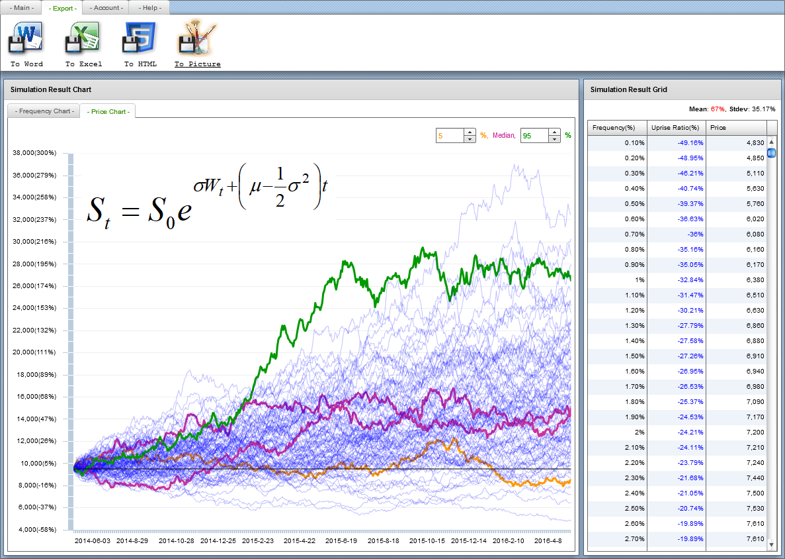
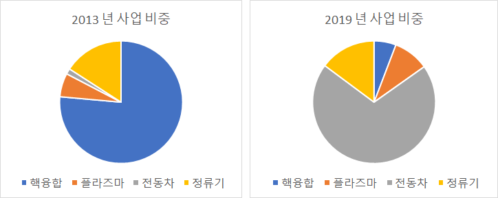

# 다원시스
## 선정 배경
본인이 대학생이던 2014 년 5 월 말, 조별로 전도유망한 기업을 발굴하고, 이를 분석하여 발표하는 과제가 있었다. 당시 본인은 바로 그 전도유망한 기업을 찾고자, 코스피와 코스닥에 상장된 전 주식회사들을 상대로, 아래의 조건으로 검색을 돌린 바 있다. 

  - 안정성: 동종업계 대비 낮은 부채비율과 높은 유동성
  - 수익성
    - 5 년간 매출 및 이익이 꾸준히 증가했을 것
    - 수익성이 동종업계 대비 상위일 것
  - 성장성: 향후 성장이 기대될 것
  - 저평가: 동종업계 대비 낮은 상대주기

다만, 본인도 위 검색 조건을 만들면서, 설마 이런 회사가 실제로 있었을까 싶었다. 재무적인 안정성을 갖췄으면서도 높은 수익률을 보이고, 게다가 성장성이 기대되면서도 주가가 동종업계 대비 저평가되어야 한다니, 세상에 그런 주식이 어디있겠나?

> 그런데 그것이 실제로 일어났습니다

헌데 놀랍게도, 저런 터무니없는 조건에 검색되어나오는 회사가 딱 하나 있었다. 그것이 바로 2014 년 5 월의 다원시스였다. 이후 6 월 발표일까지, 조원들과 함께 다원시스에 대해 조사하고 여러 방면으로 알아보면서, 이 회사의 주식이 점점 더 매력적으로 느껴졌다.

## 당시의 분석
2014 년 6 월 4 일, 조별과제에서 본인이 조사하고 발표했던 자료는 다음과 같다. 6년 전이나 지금이나, 다원시스의 사업 내용은 크게 변함이 없으니, 다원시스가 어떠한 회사인지 알고 싶다면, 아래 발표자료를 읽어보도록 한다. 그리고 다원시스의 주 사업분야이던 "핵융합" 에 대해서도, 짤막하게나마, 설명해두었다.

  - 조별 발표자료: [assets/documents/다원시스.pdf](assets/documents/다원시스.pdf)
  - 종목 검색 및 시뮬레이션: [assets/documents/samchon-simulation.pdf](assets/documents/samchon-simulation.pdf)

이 때를 기준으로, 미래의 다원시스 주가를 예측하는 데에는 "몬테카를로 시뮬레이션" 을 사용하였다. 

몬테카를로 시뮬레이션을 돌리기 위해 필요한 인자들 중, 목표 수익률은 다원시스의 사업분야별 매출액 비중에 다원시스가 공시정보에 적어놓은 해당 분야별 미래의 예상 시장규모를 곱해 사용하였다. 그리고 변동치 (리스크, 표준편차) 는 다원시스의 역대 주가 변동추이를 그대로 사용하였다.

  - 기대 수익률 (평균): 사업분야별 매출액 비중 x 해당 사업분야의 미래 시장규모 전망
  - 변동치 (표준편차): 과거 다원시스의 주가 변동률을 그대로 사용

그리고 당시의 시뮬레이션 결과는 아래와 같았다. 위 발표자료를 만들던 당시의 주가는 9,000 원으로써 목표 주가는 아래 항목 중, 등락률 평균 **67.25** 을 당시의 주가에 곱하여, **15,000** 원으로 잡았다. 실제로 다원시스의 주가는 15,000 원이 아니라 무려 그 두 배보다도 더 높은 32,000 원까지 올랐갔지만, 나름 다원시스의 주가가 크게 우상향한다는 방향성만큼은 확실하게 맞춰 기분이 좋았던 기억이 난다.

  - 등락률 평균: **67.25** %
  - 등락률 표준편차: 35.17 %
  - 손실 가능성: 9.5 %
    - 하위 5 %: -10.32 %
    - 중앙값: 56.84 %
    - 상위 5 %: 177.37 %
  - 당시 주가: 9,000 원
  - 목표 주가: 15,000 원

## 현재 상황
다원시스가 본래 성장성이 높은 회사라고 평가받던 이유는, 다원시스의 주 사업분야가 "핵융합" 에 있었기 때문이다. 차세대의 에너지원으로 평가받던 핵융합이었고, 국가 차원에서도 이를 육성코자 수십년간 부던히 노력하고 투자해왔기에, (2014 년을 기준으로) 미래에도 전도유망할 것이라 평가받았던 것이다.

하지만 현재, 한국은 정부 기조가 "탈원전" 으로 바뀌고나서, 핵융합 산업도 원자력 산업의 쇠퇴와 함께 몰락의 길을 걷고 있다. 다원시스도 요 근래에 부채비율이 79 % 에서 154 % 로 근 1 년 만에 두 배로 불어났고, 영업이익률도 급감하고 있다. 특히 다원시스의 주 사업분야인 핵융합 분야의 매출액 감소가 도드라진다.

그러나 이러한 암울한 상황에도 불구하고, 본인은 여전히 다원시스가 사 볼 만한 주식이라고 생각한다. 주 사업분야인 핵융합의 매출액 감소는 전동차 등을 비롯한 타 사업분야가 메꿔주면서 오히려 증가했고, 부채비율도 아직 위험한 수준은 아니다. 특히 수주잔액이 2013 년 약 6 천억에서 2019 년 기준 1 조 7 천억원으로 크게 증가함으로써, 다원시스가 탈원전이라는 겨울을 나기에는 충분한 액수가 아닌가 싶다.

다원시스의 현재 주가는 16,000 원으로써 이래저래 탈원전 이전 그들의 전성기 시절에 비하면, 겨우 반 밖에 안 되는 수준이기는 하다. 하지만, 탈원전으로 인한 주 사업분야의 몰락을 타 사업분야의 매출 성장으로 메워 메우고, 충분한 금액의 수주잔액을 통하여 탈원전이라는 이 한파를 이겨내고 나면, 언젠가 다시 날아오르는 날이 오지 않을까 싶다. 

탈원전이라는 정치 구호가 언제까지고 계속되지 않을 거라 생각하고서, 다원시스가 위 파이 그래프의 파란색 (핵융합) 비중이 이전처럼 되돌릴 수 있는 날이 올 거라 기대하거든, 다원시스는 여전히 매력적인 주식이다.

  - 수익률은 줄어들었으되, 매출액은 꾸준히 증가해 옴
  - 부채비율이 아직 양호함
  - 수주잔고가 많아 부실에 대한 염려가 적음
  - 핵융합은 미래 선도의 에너지 기술로써, 여전히 전도유망함

단, 다원시스의 재무 및 주가에 관한 지표들이 이전 2014 년도처럼 전부 상승을 예지하고 있는 상태는 아니다. 따라서 이번에는 2014 년과 달리, 다원시스를 장기투자의 관점으로 접근해야 할 것이다. 과거 2014 년에는 기술분석 및 계량수학의 관점으로써 다원시스를 택했다면, 이번에는 가치투자의 관점으로 다원시스를 택할 차례가 아닐까 한다.